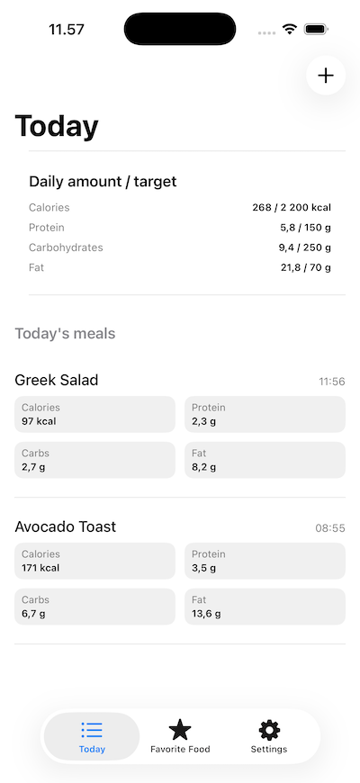
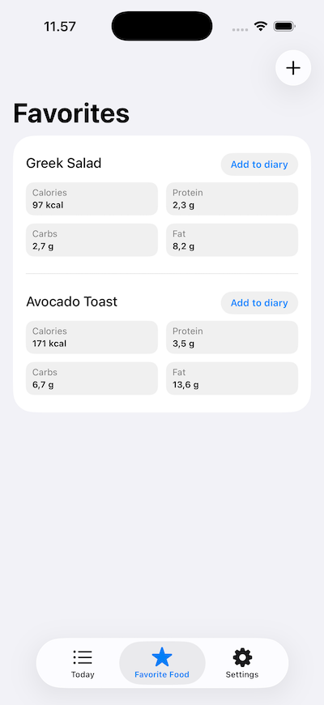
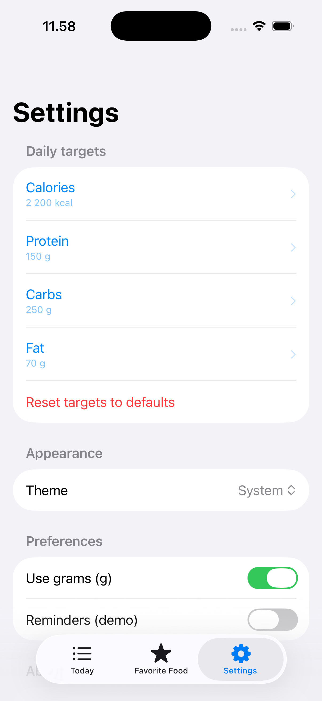

# FoodDiary
Food Diary is a demo app for iOS, built with SwiftUI + SwiftData for tracking daily food intake and nutritional values.

## Screenshots

  
  
  
  

## Features
### Today

 + Summary of daily calorie and macronutrient intake
 + Comparison to daily personal targets
 + Easy addition of meals throughout the day 
### Favorites

 + Favorite foods are easy to list here
 + Favorites can be quickly added to daily meals  
### Settings

 + Allows setting personal daily targets for calories and macronutrients
 + Dark/Light app theme

## Future developments
 + Week / Month / Year view
 + Statistics and trends
 + Food search
 + Improved accessibility
 + Additional test coverage

## Notes
This project was built for my personal portfolio.

It aims to showcase:
 + The ability to take a project from an idea to a finished, working demo
 + Clear spearation of concerns
 + Code that is easy to read and maintain
 + Use of modern Apple frameworks

## Folder structure
+ App - Application entry point
+ Features - Feature-oriented SwiftUI views and logic
+ Models - SwiftData models
+ Resources - Launch screen and app icon files
+ Shared - Shared views and reusable components
+ Utilites - Formatting and parsing helpers

Unit and UI tests are included, with limited coverage.
